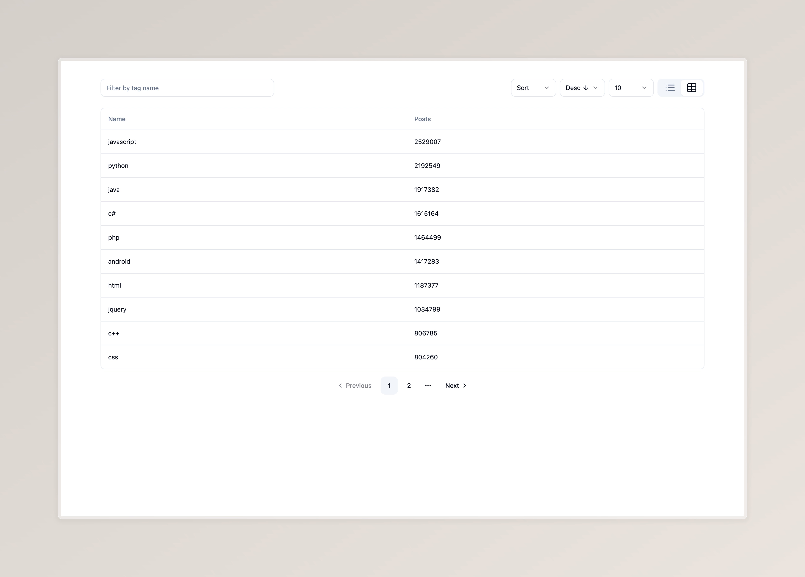

<br />
<div align="center">

<h3 align="center">React Recruitment Task</h3>

[Live demo](https://mediporta-task-beta.vercel.app/)

</div>

<details>
  <summary>Table of Contents</summary>
  <ol>
    <li>
      <a href="#about-the-project">About The Project</a>
      <ul>
        <li><a href="#built-with">Built With</a></li>
      </ul>
    </li>
    <li>
      <a href="#getting-started">Getting Started</a>
      <ul>
        <li><a href="#prerequisites">Prerequisites</a></li>
        <li><a href="#installation">Installation</a></li>
      </ul>
    </li>
    <li><a href="#contact">Contact</a></li>
  </ol>
</details>

## About The Project



The user interface of the tag browser provided by the StackOverflow API prepared in React.

[Live demo](https://mediporta-task-beta.vercel.app/)

<p align="right">(<a href="#readme-top">back to top</a>)</p>

### Built With

- [React](https://react.dev/)
- [TypeScript](https://www.typescriptlang.org/)
- [TailwindCSS](https://tailwindcss.com/)
- [Vite](https://vitejs.dev/)
- [shadcn/ui](https://ui.shadcn.com/)
- [Tanstack Query](https://tanstack.com/query/latest)
- [React Router](https://reactrouter.com/en/main)
- [Axios](https://axios-http.com/)

<p align="right">(<a href="#readme-top">back to top</a>)</p>

## Getting Started

To get a local copy up and running follow these simple steps.

### Prerequisites

- npm
  ```sh
  npm install npm@latest -g
  ```

### Installation

1. Clone the repo
   ```sh
   git clone https://github.com/rynkovski/mediporta-task.git
   ```
2. Install NPM packages
   ```sh
   npm ci
   ```
3. Start
   ```sh
   npm start
   ```
4. Open Storybook
   ```sh
   npm run storybook
   ```
   <p align="right">(<a href="#readme-top">back to top</a>)</p>

## Contact

[@rynkovski](https://github.com/rynkovski)

<p align="right">(<a href="#readme-top">back to top</a>)</p>
